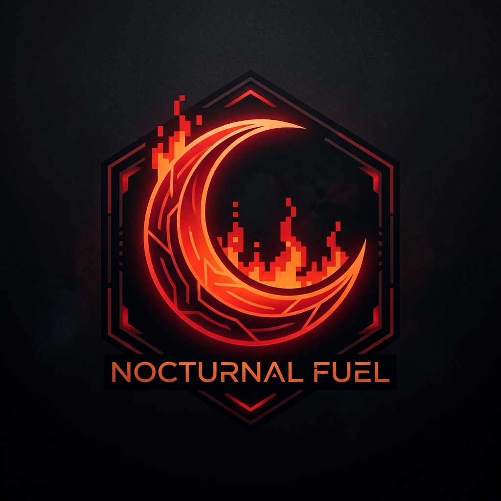

<p align="center">
  
</p>

# 🌙 Moon-Inferno

> The web doesn't need another SaaS dashboard.

Moon-Inferno is an accessibility-first UI framework designed for developers who want to build expressive websites without sacrificing usability or performance. Built for interfaces with distinct personality—retro web, Y2K, cyberpunk, CRT, pixel art, anime-inspired, and experimental aesthetics—it provides accessible, responsive, and composable primitives that feel like a forgotten futuristic corner of the early internet.

---

## Why Moon-Inferno?

Modern UI libraries have converged on uniform, sterile enterprise dashboards. While functional, they strip websites of individuality, character, and visual experimentation.

Moon-Inferno exists to reclaim expressive web design without reverting to inaccessible practices. It combines radical visual aesthetics with rock-solid semantic foundations, screen reader support, keyboard navigation, and responsive behavior.

* **Expressive Interfaces**: Retro, Y2K, cyberpunk, CRT, and pixel art aesthetics built as configurable design tokens and CSS variables.
* **Boringly Reliable Foundation**: Strict semantic HTML, full keyboard navigation, ARIA attributes, and WCAG accessibility standards.
* **True Themeability**: Decouples component behavior from visual styling, making custom themes effortless to create and swap.
* **Composable Architecture**: Prefers flexible primitive composition over massive components with dozens of rigid props.

---

## Features

* ♿ **Accessibility-first**: WCAG guidelines, screen reader support, and robust keyboard navigation baked in from day one.
* 📱 **Responsive by default**: Adapts gracefully across mobile, tablet, and desktop viewports.
* 🎨 **Themeable**: CSS variable tokens allow instant switching between retro, futuristic, and custom styles.
* 🧩 **Composable**: Modular building blocks engineered for effortless composition.
* 🌙 **Expressive visual language**: Unique aesthetics that break away from standard SaaS templates.
* ⚡ **Lightweight**: Zero unnecessary dependencies to keep bundle sizes lean.
* 🧑‍💻 **TypeScript-first**: Strict type safety and complete auto-completion support across all packages.

---

## Planned Ecosystem

Moon-Inferno is organized as a monorepo containing specialized packages:

| Package | Description |
| --- | --- |
| `@moon-inferno/core` | Framework-independent design tokens, CSS variables, responsive primitives, and accessibility utilities. |
| `@moon-inferno/react` | React component implementations (Button, Input, Dialog, Cards, Tabs, etc.). |
| `@moon-inferno/icons` | Iconography system featuring UI icons, pixel art icons, and retro/experimental symbols. |
| `@moon-inferno/themes` | Official theme definitions (`moon-inferno`, `terminal`, `y2k`). |

---

## Components Roadmap

| Component | Status | Description |
| --- | --- | --- |
| **Button** | ✅ Ready (Phase 1) | Interactive button primitive with tactile focus and active states (`inferno`, `outline`, `ghost`, `pixel`) |
| **Input** | ✅ Ready (Phase 1) | Accessible form controls with label, helper text, and error states |
| **Card** | ✅ Ready (Phase 1) | Content container with customizable borders (`CardHeader`, `CardBody`, `CardFooter`) |
| **Dialog** | Planned | Modal dialog with focus trap and keyboard dismissal |
| **Tabs** | Planned | Accessible tabbed interfaces with ARIA pattern support |
| **Tooltip** | Planned | Contextual popovers with positioning and screen reader text |
| **Toast** | Planned | Non-modal status notifications with live region updates |
| **Terminal** | Planned | Interactive terminal emulator component |
| **CRT Effects** | Planned | Scanline, chromatic aberration, and screen flicker overlays |
| **Pixel UI** | Planned | Pixel-perfect containers, borders, and decorative elements |

---

## Interactive Playground & Testing

To see and interact with all implemented components in real time:

```bash
pnpm dev
```

This launches the interactive Vite dev server at `http://localhost:5173`.

* **Sandbox File**: You can view and experiment with component code directly in [`playground/src/App.tsx`](file:///c:/Users/biagio.scaglia/Desktop/moon-inferno/playground/src/App.tsx).
* **Theme Testing**: Toggle live between `moon-inferno`, `terminal`, and `y2k` themes.

---

## Installation

Moon-Inferno is currently in early development (Phase 1 complete).
Installation instructions will be published with the first usable release.

---

## Roadmap

```text
Phase 1 — Foundation (Repository setup, design tokens, core utilities)
Phase 2 — Core components (Button, Input, Card, Typography)
Phase 3 — Interaction components (Dialog, Tabs, Menu, Tooltip, Toast)
Phase 4 — Layout system (Grid, Flex, Container, Stack)
Phase 5 — Moon-Inferno visual effects (CRT overlays, scanlines, retro shaders)
Phase 6 — Documentation (Interactive docs, playground, theme builder)
Phase 7 — First stable release (v1.0.0)
```

---

## Contributing

Contributions will be welcome once the initial core architecture stabilizes. Please refer to [CONTRIBUTING.md](CONTRIBUTING.md) for development guidelines, architecture principles, and code conventions.

---

## License

Distributed under the MIT License. See [LICENSE](LICENSE) for details.
